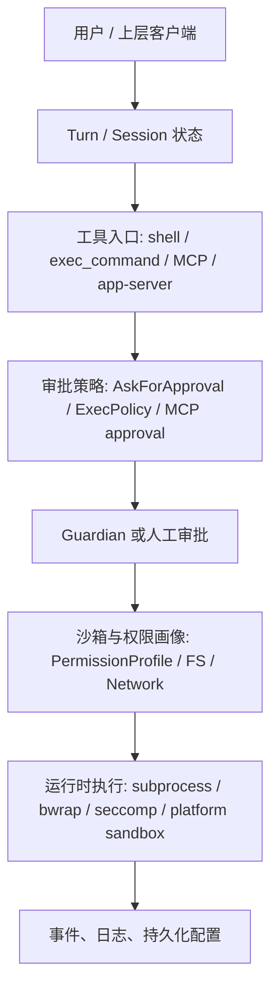
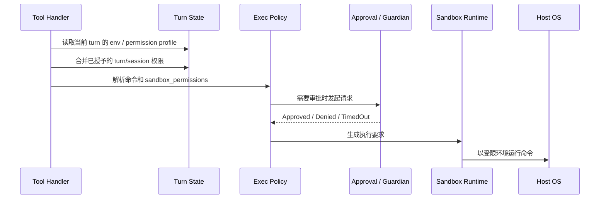
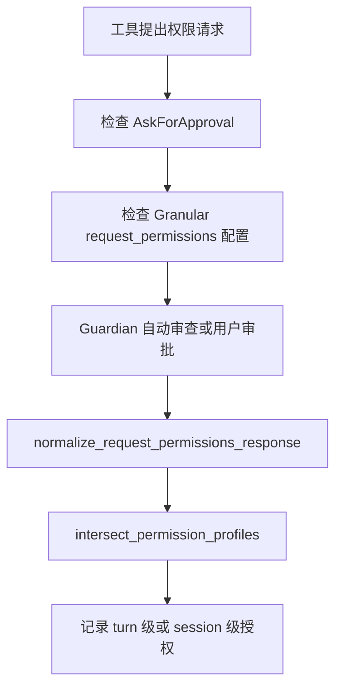

# 面向网络安全研究员的 Codex 安全架构 Onboarding

本文面向只熟悉 Python 的网络安全研究员。目标是帮助研究员快速读懂 Codex 的安全边界、权限模型、高风险命令执行路径、MCP 与连接器安全、Guardian 自动安全审查、App Server API 风险点，以及代码审查时需要盯住的关键函数。

本文基于 `.understand-anything/knowledge-graph.json` 的图谱快照和源码抽样阅读生成。图谱快照显示分析对象为 `codex-monorepo`，分析时间为 `2026-05-31T10:32:54.022Z`，对应提交 `b14f11d3d2ca048bdae1872ef66087a2ce3f6b0c`。如果源码已经变化，研究员应优先相信当前源码，再把本文当作路径地图使用。

## 0. 先建立安全研究视角

Codex 可以先看成一个“受控的本地代理运行时”。它同时具备三类能力：

| 能力 | 类比到 Python | 安全含义 |
| --- | --- | --- |
| 读写文件 | `pathlib.Path.read_text()` / `write_text()` | 可能泄露源码、密钥、配置，也可能篡改项目 |
| 执行命令 | `subprocess.run()` | 可能触发构建、网络请求、凭据读取、持久化修改 |
| 调用外部工具 | 插件、RPC、SDK client | 可能扩大信任边界，引入第三方工具行为 |

安全审查的核心问题可以写成一个简单公式：

$$
Risk = Capability \times Reachability \times Persistence \times Ambiguity
$$

- `Capability`：该路径能做什么，例如写文件、访问网络、执行命令。
- `Reachability`：攻击者能不能把输入送到这里，例如 prompt、MCP tool result、网页内容、仓库文件。
- `Persistence`：一次批准会不会变成会话级、配置级、插件级长期授权。
- `Ambiguity`：系统是否能精确解释将要发生什么，例如 shell 语法、前缀规则、工具元数据。

一个低风险操作通常满足：

$$
EffectiveCapability = RequestedCapability \cap GrantedCapability \cap SandboxBoundary
$$

研究员审查代码时，应反复确认“请求的能力、批准的能力、实际执行边界”三者是否一致。

## 1. 图谱给出的仓库分层

图谱识别到 39,902 个节点、39,927 条边、4,652 个文件节点，其中安全相关文件节点约 1,314 个。核心分层如下：

| 层 | 节点数 | 安全相关节点 | 研究重点 |
| --- | ---: | ---: | --- |
| Rust Core Agent Runtime | 776 | 254 | 会话、工具调度、命令执行、审批 |
| Rust CLI, TUI, and Terminal UX | 754 | 74 | 用户交互、审批展示、终端输入输出 |
| App Server and Desktop API | 1,037 | 263 | 桌面 API、RPC、命令执行入口 |
| MCP, Tools, Skills, and Connectors | 236 | 83 | 外部工具、插件、连接器权限 |
| Sandbox, Exec Policy, Security, and Host Integration | 207 | 134 | 沙箱、文件系统策略、网络策略、系统调用限制 |
| CI and Quality Gates | 55 | 11 | 测试、lint、快照、发布门禁 |
| Public Docs | 15 | 5 | 用户可见安全承诺与实际实现对齐 |

研究员第一遍阅读可以按“入口到边界”的方向走：

1. `codex-rs/protocol/src/protocol.rs`：线协议和枚举定义。
2. `codex-rs/protocol/src/permissions.rs`：文件系统与网络权限模型。
3. `codex-rs/core/src/config/permissions.rs`：配置如何编译成权限画像。
4. `codex-rs/core/src/tools/handlers/shell.rs`：shell 工具调用入口。
5. `codex-rs/core/src/tools/handlers/unified_exec/exec_command.rs`：统一命令执行入口。
6. `codex-rs/core/src/exec_policy.rs`：命令审批策略。
7. `codex-rs/core/src/exec.rs`：执行请求如何落到沙箱。
8. `codex-rs/core/src/guardian/`：自动安全审查。
9. `codex-rs/core/src/mcp_tool_call.rs`：MCP 工具调用与审批。
10. `codex-rs/app-server/src/request_processors/command_exec_processor.rs`：桌面 API 命令执行路径。

## 2. 给 Python 背景研究员的 Rust 速读表

Rust 代码读起来像“带类型和所有权检查的 Python 服务代码”。下面这些映射足够支撑第一轮安全审查：

| Rust 概念 | Python 类比 | 安全审查含义 |
| --- | --- | --- |
| `struct` | `@dataclass` | 数据包，关注字段是否完整、默认值是否危险 |
| `enum` | `Enum` + tagged union | 权限状态机，关注每个分支是否处理 |
| `match` | `match/case` 或多分支 `if` | 分支覆盖，关注危险分支是否有兜底 |
| `Option<T>` | `T | None` | 缺省语义，关注 `None` 是否扩大权限 |
| `Result<T, E>` | 返回值 + 异常 | 错误路径，关注失败是否关闭能力 |
| `trait` | `Protocol` / ABC | 抽象接口，关注实现是否遵守安全契约 |
| `async fn` | `async def` | 异步 I/O，关注并发状态和超时 |
| `Arc<T>` | 共享引用 | 多组件共享状态，关注谁能修改 |
| `oneshot` | 一次性 Future/Queue | 审批等待路径，关注超时和取消 |
| `serde` | `pydantic` / `json` | 线协议序列化，关注字段重命名和缺省 |

安全研究时，`enum` 尤其重要。比如审批决策可以用伪 Python 表示：

```python
class ReviewDecision(Enum):
    APPROVED = "approved"
    APPROVED_FOR_SESSION = "approved_for_session"
    DENIED = "denied"
    TIMED_OUT = "timed_out"
    ABORT = "abort"
```

这类枚举决定“能力是否放行”。研究员应逐个分支追踪，尤其是 `TimedOut`、`Abort`、解析失败、未知工具元数据等异常路径。

## 3. Codex 的安全边界全景

Codex 的安全设计可以拆成六层：



这六层分别回答不同问题：

| 层 | 回答的问题 | 典型源码 |
| --- | --- | --- |
| Turn / Session | 当前轮次拥有哪些临时授权 | `codex-rs/core/src/session/mod.rs` |
| 工具入口 | 用户请求会被解释成什么动作 | `shell.rs`, `exec_command.rs`, `mcp_tool_call.rs` |
| 审批策略 | 这次动作是否需要批准 | `exec_policy.rs`, `protocol.rs` |
| Guardian | 自动审查是否放行 | `codex-rs/core/src/guardian/` |
| 权限画像与沙箱 | OS 级边界允许什么 | `permissions.rs`, `config/permissions.rs`, `exec.rs` |
| 持久化 | 批准会不会写入长期配置 | `mcp_tool_call.rs`, config 写入路径 |

一个关键判断：Guardian 属于审批层；`PermissionProfile`、文件系统沙箱、网络策略、平台沙箱属于执行层边界。审批层给出决策，执行层限制真实能力。两层都需要审查。

## 4. 核心类型和权限词汇

### 4.1 `AskForApproval`

位置：`codex-rs/protocol/src/protocol.rs`

`AskForApproval` 决定命令或工具何时触发审批：

| 值 | 直觉解释 | 安全含义 |
| --- | --- | --- |
| `UnlessTrusted` | 受信项目少打扰，其他项目多审批 | 项目信任状态会影响默认风险 |
| `OnFailure` | 失败后再请求更高权限 | 适合先试沙箱，风险是失败命令本身也可能泄露信息 |
| `OnRequest` | 工具明确请求时审批 | 高风险操作常走这里 |
| `Granular` | 用更细规则控制 | 能降低打扰，也容易被规则配置复杂度拖垮 |
| `Never` | 不请求审批 | 安全上意味着能力应被沙箱强限制 |

研究员应重点检查 `OnRequest` 和 `Granular`。这两类配置允许系统把审批交给用户或 Guardian，也最容易出现“批准粒度过宽”的问题。

### 4.2 `SandboxPermissions`

位置：`codex-rs/protocol/src/models.rs`

`SandboxPermissions` 描述某个工具调用对沙箱的请求：

| 值 | 直觉解释 |
| --- | --- |
| `UseDefault` | 使用当前默认权限画像 |
| `RequireEscalated` | 请求越过默认沙箱，需要审批 |
| `WithAdditionalPermissions` | 在当前基础上追加具体权限 |

Python 类比：

```python
def run(command, sandbox="default", extra_permissions=None):
    ...
```

风险点在 `extra_permissions`。如果追加权限表达得太宽，例如整个磁盘写入、长期网络开放、模糊前缀规则，审批层必须足够精确。

### 4.3 `PermissionProfile`

位置：`codex-rs/protocol/src/permissions.rs` 和 `codex-rs/core/src/config/permissions.rs`

`PermissionProfile` 是编译后的权限画像，类似一个 Python `dataclass`：

```python
@dataclass
class PermissionProfile:
    fs: FileSystemSandboxPolicy
    network: NetworkSandboxPolicy
```

内置画像包括：

| 名称 | 含义 |
| --- | --- |
| `:read-only` | 默认只读，适合探索 |
| `:workspace` | 工作区可写，系统其他位置受限 |
| `:danger-full-access` | 关闭文件系统限制，高危 |

`default_builtin_permission_profile_name` 会根据项目受信状态和平台能力选择默认画像。研究员应把默认画像当成攻击面的一部分，因为“默认值”会影响每个工具调用的起点。

### 4.4 文件系统访问优先级

位置：`codex-rs/protocol/src/permissions.rs`

文件系统策略里，访问模式有：

| 模式 | 含义 |
| --- | --- |
| `Read` | 可读 |
| `Write` | 可写，通常也意味着可读 |
| `Deny` | 禁止访问 |

冲突优先级是：

$$
Deny > Write > Read
$$

可以用 Python 伪代码表达：

```python
def resolve_access(path, entries):
    matches = [entry.access for entry in entries if entry.matches(path)]
    if "deny" in matches:
        return "deny"
    if "write" in matches:
        return "write"
    if "read" in matches:
        return "read"
    return "deny"
```

默认返回 `Deny` 很关键。默认拒绝像门禁系统：没有匹配到门禁卡权限时，门不会打开。

## 5. 高风险命令执行路径

Codex 有两条重要命令入口：

| 入口 | 位置 | 典型用途 |
| --- | --- | --- |
| shell tool | `codex-rs/core/src/tools/handlers/shell.rs` | 常规 shell 命令工具 |
| unified exec command | `codex-rs/core/src/tools/handlers/unified_exec/exec_command.rs` | 更结构化的命令执行工具 |

两条路径的安全结构很相似：



对应的 Python 心智模型：

```python
def execute_command(args, session, turn):
    env = turn.primary_environment()
    granted = session.permissions_for_turn(turn.id)
    requested = args.additional_permissions

    effective_request = merge_permissions(requested, granted)

    if args.requests_sandbox_override and not args.preapproved:
        require(args.approval_policy == "on-request")

    normalized = normalize_permissions(effective_request)

    if looks_like_apply_patch(args.command):
        return apply_patch_handler(args)

    requirement = exec_policy.evaluate(
        command=args.command,
        approval_policy=args.approval_policy,
        permission_profile=turn.permission_profile,
        sandbox_permissions=args.sandbox_permissions,
        prefix_rule=args.prefix_rule,
    )

    return sandbox_runtime.run(args.command, requirement)
```

### 5.1 `shell.rs` 的关键逻辑

位置：`codex-rs/core/src/tools/handlers/shell.rs`

关键点：

- `run_exec_like` 是 shell 工具主要入口。
- 它从当前 turn 获取主环境、feature flags、批准策略、权限画像。
- 它调用 `apply_granted_turn_permissions`，把当前轮次或会话中已经批准的权限合并进请求。
- 它会判断额外权限是否允许：`ExecPermissionApprovals` 或预批准的 request-permissions feature 才能扩大权限。
- 如果工具请求 sandbox override，且当前审批策略并非允许这类请求，路径会拒绝。
- `apply_patch` 被特殊拦截，走补丁处理路径，避免把补丁误当普通 shell 命令。
- 最后创建 `ExecApprovalRequirement`，交给 `ToolOrchestrator` 和 `ShellRuntime` 执行。

审查问题：

1. 已授予权限是否只在预期作用域生效。
2. `sandbox_permissions` 是否能被未授权输入控制。
3. `prefix_rule` 是否过宽。
4. `apply_patch` 拦截是否覆盖所有应覆盖的路径。
5. 审批失败和解析失败是否关闭执行。

### 5.2 `exec_command.rs` 的关键逻辑

位置：`codex-rs/core/src/tools/handlers/unified_exec/exec_command.rs`

关键点：

- 解析结构化参数，校验 `cmd` 不能为空。
- 合并 turn/session 已批准权限。
- 在非 `OnRequest` 情况下拒绝普通 sandbox override 请求。
- 调用 `normalize_and_validate_additional_permissions` 校验额外权限。
- 拦截 `apply_patch`。
- 构造 `ExecCommandRequest`，其中包含命令、cwd、环境变量、network、TTY、sandbox 请求、额外权限、审批说明、前缀规则。

这条路径更像 Python 里的“结构化 subprocess wrapper”。安全价值在于参数显式，安全风险在于字段变多后组合爆炸。研究员应重点看字段之间是否互斥，例如 `sandbox_permissions`、`additional_permissions`、`additional_permissions_preapproved` 的组合。

## 6. ExecPolicy：命令审批的判定器

位置：`codex-rs/core/src/exec_policy.rs`

`ExecPolicy` 的任务是把“命令 + 当前权限 + 审批策略”转成三类结果：

| 结果 | 含义 |
| --- | --- |
| `Forbidden` | 禁止执行 |
| `NeedsApproval` | 需要用户或 Guardian 审批 |
| `Skip` | 可以跳过审批 |

公式化理解：

$$
Decision = Policy(CommandSegments, ApprovalPolicy, PermissionProfile, SandboxRequest)
$$

这里最重要的是 `CommandSegments`。shell 命令可能包含管道、`&&`、`;`、重定向、变量展开、子 shell。解析不精确时，系统应降低信任，要求审批或拒绝。原因很直接：`git status` 和 `git status && curl ...` 表面前缀相同，真实效果完全不同。

### 6.1 前缀规则的风险

`exec_policy.rs` 维护了 `BANNED_PREFIX_SUGGESTIONS`。宽泛前缀会被禁止，例如：

- `python`
- `python -c`
- `py`
- `git`
- `powershell`
- `pwsh`
- shell 程序自身

安全原因：前缀规则类似“通行证”。如果通行证写成 `python`，任何 Python 脚本都可能被放行，相当于把任意代码执行包装进一个看似普通的前缀。更安全的前缀应尽量像：

```text
cargo test -p codex-core
just fmt
npm run dev
```

也就是“命令 + 子命令 + 明确目标”。

### 6.2 审批绕过条件

`Decision::Allow` 只有在每个解析出的命令段都能被允许规则明确覆盖时，才会产生 `bypass_sandbox`。这点很重要，因为复杂 shell 语法会让“命令到底做了什么”变得不透明。

审查问题：

1. 命令分段是否保守。
2. 解析失败时是否会放大信任。
3. 规则是否覆盖所有命令段。
4. `bypass_sandbox` 是否只在规则精确命中时出现。

## 7. 权限请求生命周期

位置：`codex-rs/core/src/session/mod.rs`

权限请求可以走人工审批，也可以走 Guardian 自动审查。核心函数包括：

- `request_command_approval`
- `request_permissions_for_cwd`
- `normalize_request_permissions_response`
- `record_granted_request_permissions_for_turn`

生命周期如下：



`normalize_request_permissions_response` 的关键思想是“批准结果仍然要和请求做交集”。这类似 Python 里对用户输入做白名单过滤：

```python
granted = intersect(requested_permissions, reviewer_response.permissions)
```

如果启用了 strict auto review，会话级授权会被压回 turn 级。这会降低持久化授权的风险。研究员应重点关注“审批结果能否升级为 session scope”，因为 session scope 会影响后续动作。

## 8. Guardian 自动安全审查

位置：`codex-rs/core/src/guardian/`

Guardian 是一个专门审查高风险请求的代理会话。它处理两类重要对象：

| 对象 | 例子 |
| --- | --- |
| 命令审批 | shell、exec command |
| MCP 审批 | 外部工具调用、表单式 elicitation |

### 8.1 Guardian 的路由条件

`routes_approval_to_guardian` 只在审批策略为 `OnRequest` 或 `Granular`，且 `approvals_reviewer == AutoReview` 时生效。也就是说，Guardian 并非每次命令都会运行。

### 8.2 Guardian 的输入

`build_guardian_prompt_items` 会构造两类输入：

- 紧凑对话上下文。
- 即将执行的 action JSON。

提示词明确要求把 transcript、tool args、tool results、planned action 都当成不受信证据。安全含义很明确：网页内容、工具输出、模型自己的前文都可能是 prompt injection 的载体。

### 8.3 Guardian 的失败策略

Guardian 的设计采取 fail closed：

| 失败类型 | 结果 |
| --- | --- |
| 超时 | `TimedOut` |
| 会话启动失败 | 拒绝 |
| 输出无法解析 | 拒绝 |
| runtime 构建失败 | 拒绝 |

它还使用锁定的审查会话：

- 只读沙箱。
- 审批策略为 `Never`。
- 关闭非必要功能。
- 不继承普通 exec-policy rules。
- 可复用父级 managed-network allowlist。

### 8.4 Guardian 的剩余风险

Guardian 属于“判官”，沙箱属于“门锁”。判官判断是否应放行，门锁限制真正能碰到什么。若门锁配置过宽，判官一次误判会带来较大影响。若门锁足够窄，判官误判的伤害范围会变小。

研究员审查 Guardian 时应看：

1. 审查输入是否完整。
2. 是否把工具结果和网页内容标记为不受信。
3. JSON 解析是否严格。
4. 超时和解析失败是否拒绝。
5. 审查会话自身是否能执行危险动作。

## 9. 文件系统与网络沙箱

位置：

- `codex-rs/protocol/src/permissions.rs`
- `codex-rs/core/src/config/permissions.rs`
- `codex-rs/core/src/exec.rs`
- `codex-rs/linux-sandbox/src/linux_run_main.rs`

### 9.1 文件系统沙箱

`FileSystemSandboxPolicy` 包含：

- 沙箱类型：`Restricted`、`Unrestricted`、`ExternalSandbox`。
- 访问条目：路径或特殊路径映射到 `Read`、`Write`、`Deny`。

特殊路径包括：

| 特殊路径 | 含义 |
| --- | --- |
| `:root` | 仓库根或工作根 |
| `:workspace_roots` | 工作区根集合 |
| `:tmpdir` | 临时目录 |
| `:minimal` | 最小必需路径集合 |

`workspace_write_with` 会给工作区写权限，同时给 `.git`、`.agents`、`.codex` 等目录附加只读保护。这些目录常含仓库状态、代理配置、技能或运行时信息，误写会造成供应链和持久化风险。

### 9.2 网络策略

`NetworkSandboxPolicy` 包含：

| 值 | 含义 |
| --- | --- |
| `Restricted` | 网络受限 |
| `Enabled` | 网络开放 |

网络开放要结合命令和工具看。`cargo test` 可能只跑本地测试，`cargo test` 里的 build script 或测试逻辑也可能触网。`python script.py` 更难判断，因为脚本内容本身就是动态代码。

### 9.3 Linux 沙箱

`codex-rs/linux-sandbox/src/linux_run_main.rs` 显示当前 Linux 路径以 `bwrap` 为默认实现，并结合：

- 文件系统视图隔离。
- `no_new_privs`。
- `seccomp`。
- legacy Landlock fallback。

可以把它类比为 Python 进程启动前做了三件事：

```python
mount_restricted_filesystem_view()
apply_no_new_privs()
apply_syscall_filter()
execve(target_command)
```

研究员应区分“Codex 层权限画像”和“OS 层沙箱机制”。前者是策略描述，后者是强制执行。策略描述如果没有被运行时正确转译，实际边界会变弱。

## 10. MCP、插件和连接器安全

位置：

- `codex-rs/core/src/mcp_tool_call.rs`
- `codex-rs/core/src/session/mcp.rs`
- `codex-rs/codex-mcp/src/connection_manager.rs`

MCP 工具可以来自本地服务器、插件、连接器、host-owned app。它们扩大了 Codex 的能力面。

### 10.1 MCP 工具审批默认值

`requires_mcp_tool_approval` 的逻辑可以概括为：

| 工具元数据 | 默认审批 |
| --- | --- |
| `destructive_hint = true` | 需要审批 |
| `read_only_hint = true` | 可跳过审批 |
| 元数据未知或 open world | 需要审批 |

这是一条保守规则：未知工具默认需要审批。研究员应检查新增工具是否错误标记为 read-only。

### 10.2 MCP 审批持久化

MCP 审批决策包括：

- `Accept`
- `AcceptForSession`
- `AcceptAndRemember`
- `Decline`
- `Cancel`

风险最高的是 `AcceptAndRemember`，因为它会写入配置：

- app 配置路径：`apps.<connector_id>.tools.<tool_name>.approval_mode = approve`
- plugin/custom server 配置路径：`plugins...mcp_servers.<server>.tools.<tool_name>.approval_mode = approve`

这类似浏览器里“始终允许此网站访问摄像头”。一次点击会改变未来默认行为。

### 10.3 MCP elicitation 的 Guardian 审查

`session/mcp.rs` 里的 `GuardianMcpElicitationReviewer` 会把部分 MCP elicitation 转成 Guardian 审查请求。当前逻辑要求：

- 必须是 form elicitation。
- metadata 必须声明需要 approval。
- metadata 必须声明 `mcp_tool_call`。
- form schema 必须为空。
- `tool_name` 必须非空。
- `tool_params` 必须是 object。

这些限制降低了“外部 MCP 服务器用复杂表单绕过审批语义”的风险。

### 10.4 MCP 威胁模型

| 威胁 | 攻击方式 | 控制点 |
| --- | --- | --- |
| 工具元数据欺骗 | 把破坏性工具标为 read-only | `requires_mcp_tool_approval`、工具审核 |
| prompt injection | 工具返回内容诱导模型执行危险动作 | Guardian prompt、工具结果不受信标记 |
| OAuth token 滥用 | 连接器携带外部账户权限 | connector identity、tool provenance |
| 持久化放行 | `AcceptAndRemember` 写入配置 | config 写入路径、审计 |
| open world 工具 | 工具能访问外部网络或任意资源 | 默认审批、沙箱、网络策略 |

## 11. App Server 和桌面 API 风险点

位置：

- `codex-rs/app-server-protocol/src/protocol/v2/thread.rs`
- `codex-rs/app-server-protocol/src/protocol/v2/command_exec.rs`
- `codex-rs/app-server/src/request_processors/command_exec_processor.rs`

App Server 是桌面或外部客户端与 Codex 交互的 API 层。研究员应把它视为一个本地 RPC 服务。

### 11.1 Thread 启动参数

`ThreadStartParams` 包含：

- `approval_policy`
- `approvals_reviewer`
- `sandbox`
- `permissions`

其中 `permissions` 和 legacy `sandbox` 不能组合使用。双轨配置容易产生“调用方以为用了 A，服务端实际用了 B”的混淆风险。

### 11.2 command/exec 参数

`CommandExecParams` 包含：

- `cmd`
- `processId`
- `tty`
- `streamStdin`
- `streamStdoutStderr`
- `outputCap`
- `disableOutputCap`
- `timeout`
- `disableTimeout`
- `cwd`
- `env`
- `sandboxPolicy`
- `permissionProfile`

`command_exec_processor.rs` 做了多项校验：

- 命令不能为空。
- `sandboxPolicy` 和 `permissionProfile` 不能同时出现。
- `size` 需要 `tty`。
- `outputCap` 和 `disableOutputCap` 互斥。
- `timeout` 和 `disableTimeout` 互斥。
- cwd 和 env 会解析后传入执行请求。

这些校验看起来像普通 API validation，安全意义很大。互斥字段如果允许混用，攻击者可能利用服务端解释差异绕过预期边界。

### 11.3 `thread_shell_command` 高风险边缘

`thread_shell_command` 的文档说明它保留 shell 语法，并且以完整访问运行，不继承 thread sandbox。研究员应把这条路径当成显式高危 API。审查时要确认：

1. 哪些客户端能调用。
2. 用户是否明确知道它的边界。
3. 日志和事件是否足够清晰。
4. 它是否能被网页、插件、MCP 间接触发。

## 12. 子代理与权限继承

位置：

- `codex-rs/core/src/tools/handlers/multi_agents_v2/spawn.rs`
- `codex-rs/core/src/tools/handlers/multi_agents_common.rs`
- `codex-rs/core/src/agent/control.rs`

`spawn_agent` 会创建子代理。关键安全点是继承：

- 子代理配置会从父 turn 读取 approval policy。
- 子代理 cwd 会继承父级 cwd。
- 子代理 permission profile 会从父 turn 复制。
- 子代理 shell environment policy 会继承。
- role overlay 可以改变模型、指令或职责。

Python 类比：

```python
child = Agent(
    cwd=parent.cwd,
    approval_policy=parent.approval_policy,
    permission_profile=parent.permission_profile,
    role=role_overlay,
)
```

安全含义：子代理是另一个执行主体。它继承父级能力包络后，审批路由可以补偿风险，权限最小化仍需额外设计。研究员审查子代理时应检查：

1. 子代理是否只拿到完成任务所需的最小权限。
2. role overlay 是否能扩大工具或系统指令能力。
3. 子代理输出是否会影响父代理后续决策。
4. 子代理执行记录是否能被追踪。

## 13. 威胁建模矩阵

| 资产 | 入口 | 攻击目标 | 现有控制 | 剩余风险 | 关键文件 |
| --- | --- | --- | --- | --- | --- |
| 工作区文件 | shell / exec / app-server | 读取密钥、篡改源码 | `PermissionProfile`, FS sandbox | 宽写权限、错误特殊路径 | `permissions.rs`, `config/permissions.rs` |
| 网络 | shell / MCP / tests | 数据外传、下载 payload | `NetworkSandboxPolicy`, managed proxy | build script 或脚本间接触网 | `exec.rs`, `guardian/` |
| 命令执行 | shell tool | 任意代码执行 | `ExecPolicy`, approval, sandbox | 复杂 shell 解析、宽前缀 | `shell.rs`, `exec_policy.rs` |
| 统一执行 | exec_command | 绕过普通 shell 入口 | 参数校验、权限规范化 | 字段组合复杂 | `exec_command.rs` |
| MCP 工具 | connector/plugin | 外部账户操作、持久授权 | approval mode, tool annotations | read-only hint 错误 | `mcp_tool_call.rs` |
| MCP elicitation | MCP server | 借表单触发工具 | schema 限制、Guardian | metadata 欺骗 | `session/mcp.rs` |
| Guardian | approval reviewer | 放行危险请求 | fail closed、只读审查会话 | prompt injection、上下文缺失 | `guardian/review.rs`, `guardian/prompt.rs` |
| 子代理 | spawn_agent | 横向扩大任务能力 | 继承审批、role 控制 | 初始能力包络过宽 | `spawn.rs`, `multi_agents_common.rs` |
| App Server | local RPC | 高权限命令执行 | 参数互斥校验、auth/transport | 本地客户端信任边界 | `command_exec_processor.rs` |
| 配置持久化 | approval remember | 长期绕过审批 | config key 明确 | 一次误批长期生效 | `mcp_tool_call.rs` |

## 14. 安全审查清单

研究员审查任何安全相关 PR 时，可以按下面问题逐项过：

1. 新代码是否扩大了工具可达能力。
2. 新代码是否在审批前就执行了副作用。
3. `AskForApproval::Never` 路径下是否仍有强沙箱边界。
4. `OnRequest` 和 `Granular` 路径是否正确触发 Guardian 或用户审批。
5. 额外权限是否经过规范化和交集限制。
6. session scope 授权是否有明确用户动作。
7. broad prefix rule 是否被拒绝。
8. shell 命令解析失败时是否要求审批或拒绝。
9. `apply_patch` 这类特殊命令是否被正确拦截。
10. MCP 工具的 read-only/destructive hint 是否可信。
11. `AcceptAndRemember` 是否只写入预期配置键。
12. App Server 字段互斥是否完整。
13. `permissionProfile` 与 legacy `sandboxPolicy` 是否存在混淆。
14. Guardian 失败路径是否 fail closed。
15. 子代理是否继承了过宽权限。
16. 测试是否覆盖拒绝、超时、解析失败、未知元数据。

## 15. 建议优先读的测试

测试比文档更接近真实安全契约。研究员可以优先搜索这些文件或测试名：

| 主题 | 建议路径 |
| --- | --- |
| 命令审批 | `codex-rs/core/tests/suite/approvals.rs` |
| 权限请求 | `codex-rs/core/tests/suite/request_permissions.rs` |
| Exec policy | `codex-rs/core/tests/suite/exec_policy.rs` |
| MCP 工具审批 | `codex-rs/core/tests/suite/mcp_tool_call_tests.rs` |
| Guardian | `codex-rs/core/tests/suite/guardian*.rs` 或 `codex-rs/core/src/guardian/` 附近测试 |
| App Server command exec | `codex-rs/app-server/tests/suite/v2/command_exec.rs` |
| 权限解析 | `codex-rs/protocol/src/permissions.rs` 内联测试 |
| Linux sandbox | `codex-rs/linux-sandbox/` 测试与源码 |

读测试时重点关注断言名称。安全测试名通常直接暴露设计意图，例如“未知工具需要审批”“超时拒绝”“deny 优先级高于 write”。

## 16. 高复杂度热点文件

这些文件适合做第二轮深读：

| 文件 | 为什么重要 |
| --- | --- |
| `codex-rs/core/src/session/mod.rs` | 会话状态、审批等待、权限记录集中在这里 |
| `codex-rs/core/src/tools/handlers/shell.rs` | shell 工具执行入口 |
| `codex-rs/core/src/tools/handlers/unified_exec/exec_command.rs` | 结构化命令执行入口 |
| `codex-rs/core/src/exec_policy.rs` | 审批判定和前缀规则 |
| `codex-rs/core/src/exec.rs` | 命令请求转成沙箱执行 |
| `codex-rs/protocol/src/permissions.rs` | 文件系统和网络权限模型 |
| `codex-rs/core/src/config/permissions.rs` | 配置到权限画像的编译逻辑 |
| `codex-rs/core/src/guardian/review.rs` | Guardian 审查主流程 |
| `codex-rs/core/src/guardian/prompt.rs` | 审查提示词和 JSON schema |
| `codex-rs/core/src/mcp_tool_call.rs` | MCP 调用、审批、持久化授权 |
| `codex-rs/core/src/session/mcp.rs` | MCP elicitation 与 Guardian 对接 |
| `codex-rs/codex-mcp/src/connection_manager.rs` | MCP server、tool provenance、elicitation 管理 |
| `codex-rs/app-server/src/request_processors/command_exec_processor.rs` | 桌面 API 命令执行处理 |
| `codex-rs/core/src/tools/handlers/multi_agents_common.rs` | 子代理配置继承 |
| `codex-rs/core/src/tools/handlers/multi_agents_v2/spawn.rs` | 子代理 spawn 入口 |
| `codex-rs/core/src/agent/control.rs` | 子代理生命周期控制 |

## 17. 一周阅读路线

### 第 1 天：建立 Rust 心智模型

阅读：

- `codex-rs/protocol/src/protocol.rs`
- `codex-rs/protocol/src/models.rs`

目标：

- 看懂 `enum`、`struct`、`Option`、`Result`。
- 写出审批策略、sandbox 请求、review decision 的状态图。

### 第 2 天：权限画像

阅读：

- `codex-rs/protocol/src/permissions.rs`
- `codex-rs/core/src/config/permissions.rs`

目标：

- 理解 `Deny > Write > Read`。
- 理解 `:read-only`、`:workspace`、`:danger-full-access`。
- 能解释 `permissionProfile` 和 legacy `sandbox` 的差异。

### 第 3 天：命令执行

阅读：

- `codex-rs/core/src/tools/handlers/shell.rs`
- `codex-rs/core/src/tools/handlers/unified_exec/exec_command.rs`
- `codex-rs/core/src/exec_policy.rs`
- `codex-rs/core/src/exec.rs`

目标：

- 画出从工具调用到 OS 进程的路径。
- 找到所有拒绝路径。
- 找到 `apply_patch` 特殊处理。

### 第 4 天：Guardian

阅读：

- `codex-rs/core/src/guardian/mod.rs`
- `codex-rs/core/src/guardian/review.rs`
- `codex-rs/core/src/guardian/prompt.rs`

目标：

- 理解 Guardian 的路由条件。
- 理解 fail closed。
- 检查提示词是否把输入当成不受信证据。

### 第 5 天：MCP 和插件

阅读：

- `codex-rs/core/src/mcp_tool_call.rs`
- `codex-rs/core/src/session/mcp.rs`
- `codex-rs/codex-mcp/src/connection_manager.rs`

目标：

- 理解 tool annotations。
- 理解 `AcceptForSession` 和 `AcceptAndRemember`。
- 画出 MCP tool approval key 的持久化路径。

### 第 6 天：App Server

阅读：

- `codex-rs/app-server-protocol/src/protocol/v2/thread.rs`
- `codex-rs/app-server-protocol/src/protocol/v2/command_exec.rs`
- `codex-rs/app-server/src/request_processors/command_exec_processor.rs`

目标：

- 理解本地 RPC 如何启动 thread 和命令。
- 找出 `thread_shell_command` 的调用边界。
- 检查字段互斥和默认值。

### 第 7 天：做一次小型威胁建模

选择一个入口，例如 MCP 工具调用，写出：

1. 攻击者能控制什么输入。
2. 输入进入哪个函数。
3. 哪个函数做审批。
4. 哪个函数做沙箱执行。
5. 授权是否会持久化。
6. 失败路径是否拒绝。

可以用这个模板：

```text
入口:
攻击者控制:
能力:
审批点:
执行边界:
持久化点:
失败路径:
剩余风险:
建议测试:
```

## 18. 研究员容易漏掉的背景

### 18.1 审批和沙箱是两类控制

审批回答“这件事是否允许尝试”。沙箱回答“即使尝试，最多能碰到什么”。单靠审批无法替代沙箱，单靠沙箱也无法表达用户意图。两者需要同时成立。

### 18.2 `cwd` 是安全参数

`cwd` 决定相对路径、workspace root、权限解析上下文。攻击者如果能影响 `cwd`，就可能改变文件系统策略的实际范围。

### 18.3 “只读工具”也可能有风险

只读工具仍可能读取秘密并把结果交给模型上下文。若后续动作允许联网或写入，秘密可能间接外流。审查 read-only hint 时，应关注读到的数据类型。

### 18.4 输出上限和超时属于安全控制

`outputCap`、`timeout` 同样属于安全控制。无限输出可能造成资源消耗，长时间命令可能等待外部交互或拖住审批流程。

### 18.5 配置写入就是持久化攻击面

任何 `AcceptAndRemember`、session scope、config mutation 都要当作持久化能力审查。一次看似正常的批准可能改变未来所有会话。

## 19. 最短路径总结

如果研究员时间很少，优先读这五条路径：

1. `shell.rs` / `exec_command.rs`：高风险命令如何进入系统。
2. `exec_policy.rs`：系统如何判断批准、拒绝、跳过。
3. `permissions.rs` / `config/permissions.rs`：真实文件和网络边界如何表达。
4. `guardian/review.rs` / `guardian/prompt.rs`：自动安全审查如何工作和失败。
5. `mcp_tool_call.rs` / `session/mcp.rs`：外部工具和连接器如何被审批与持久化。

读完这五条路径后，研究员就能回答 Codex 安全审查里最重要的三个问题：

1. 这个输入能到达哪个危险能力。
2. 这个危险能力在哪里被审批。
3. 审批通过后，执行层还能限制多少真实影响。
